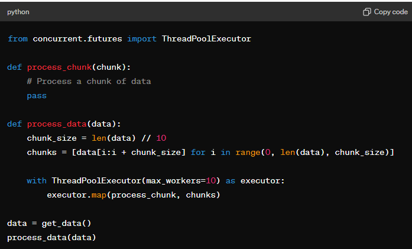

### **Tell me About yourself.**

**Response:**

**Introduction:**

Hello! My name is Avinash Mahala, and I am a full-stack software engineer with over four years of professional experience. I recently completed my Master's in Computer Science Engineering from the University of Texas at Arlington, where I gained a solid foundation in advanced software development principles and methodologies.

**Educational Background:**

My journey in software development began with a Bachelor's degree in Computer Science Engineering from Biju Patnaik University of Technology. Since then, I have had the opportunity to work with renowned companies like General Electric and Wipro Limited.

**Professional Experience:**

At General Electric, I worked as a Software Engineer, where I played a crucial role in refactoring data-intensive API services using C# and SQL query optimization techniques. This effort led to a remarkable 94% reduction in latency for processing over 100,000 records. I also collaborated with cross-functional teams to enhance operational efficiency by 90% through the development of new interfaces using React.js.

At Wipro Limited, I served as a Project Engineer, leading the development of a vehicle tracking system middleware. My work resulted in a 91% decrease in downtime and bolstered system stability. I also introduced a data-centric recommendation engine that reduced fuel consumption by 19%, showcasing the effectiveness of data-driven decision-making.

**Key Projects:**

In addition to my professional experience, I have completed several projects that demonstrate my technical proficiency and problem-solving abilities. For example, I developed an Email Automator using Python and implemented a robust logging system to track actions and errors. Another notable project was the Property Data Management System, where I utilized Node.js, Express.js, MongoDB, and React.js to build a modern and responsive application.

**Technical Skills:**

I am highly proficient in a range of technologies, including Python, Java, C#, JavaScript, and frameworks like React.js, Node.js, and ASP.Net Core. My experience with cloud platforms such as AWS and Azure, along with tools like Docker, Jenkins, and Git, has equipped me with the skills needed to deliver scalable and maintainable software solutions.

**Passion and Interests:**

I am passionate about continuous learning and staying ahead of the technology curve. I enjoy taking on complex challenges and collaborating with talented teams to create innovative solutions. I am excited about the opportunity to bring my skills and experience to your team and contribute to the success of your projects.

**Conclusion:**

Thank you for considering my application. I look forward to discussing how my background and skills align with your needs.

### 

### **Mock Technical Questions and Sample Answers**

**1. Can you describe a project where you developed a REST API? What were the challenges and how did you overcome them?**

Sample Answer:

"Certainly. In my previous role at General Electric, I worked on developing a REST API for a data-intensive service that managed over 100,000 records. The main challenge was optimizing the API for performance while ensuring data accuracy. To address this, I used SQL query optimization techniques to reduce latency by 94%. Additionally, I implemented caching mechanisms using Redis to further enhance performance. By closely monitoring API performance and continuously refining the code, we achieved a highly efficient and reliable API."

**2. How have you used Azure DevOps in your previous roles?**

Sample Answer:

"At Wipro Limited, I extensively used Azure DevOps for managing CI/CD pipelines. I was responsible for setting up pipelines that automated the build, test, and deployment processes. This included configuring pipelines to integrate with our version control system, running automated tests using Selenium, and deploying applications to Azure App Services. Using Azure DevOps, we were able to significantly reduce deployment times and ensure consistent and reliable releases."

**3. Explain a scenario where you had to troubleshoot a production issue. How did you handle it?**

Sample Answer:

"While at General Electric, we encountered a critical issue in production where our API service was experiencing unexpected downtimes. I led the troubleshooting efforts, starting with a thorough analysis of the logs to identify any anomalies. We discovered that a memory leak was causing the service to crash. I implemented a fix by optimizing memory management in the code and adding monitoring tools to detect similar issues in the future. This proactive approach not only resolved the immediate problem but also prevented future occurrences."

**4. Describe your experience with GraphQL. How did you implement it in a project?**

Sample Answer:

"In one of my projects, we decided to implement GraphQL to provide more flexible and efficient data queries for our frontend application. I worked on setting up the GraphQL server using Apollo Server and integrated it with our existing REST APIs. The main challenge was ensuring seamless integration and data consistency. By creating well-defined schemas and resolvers, we were able to offer a more intuitive and powerful query mechanism for our clients. This implementation significantly improved data retrieval efficiency and client satisfaction."

**5. Can you discuss your experience with mobile application development, particularly using Xamarin?**

Sample Answer:

"Although I haven't worked extensively with Xamarin, I have a solid background in mobile application development. At General Electric, I contributed to developing a mobile app using React Native. My focus was on implementing features and ensuring offline sync capabilities. I collaborated with the team to integrate local storage solutions and handle synchronization issues effectively. Given my experience with mobile app development and quick learning abilities, I am confident I can quickly adapt to and excel in using Xamarin for iOS application development."

**6. How do you ensure compliance with regulatory standards such as HIPAA in your projects?**

Sample Answer:

"Ensuring compliance with regulatory standards like HIPAA is crucial in any project involving sensitive data. In a previous role, I worked on a healthcare application where data privacy and security were paramount. We implemented encryption for data at rest and in transit, conducted regular security audits, and followed best practices for secure coding. Additionally, we made sure to document all processes and maintain compliance checklists to ensure we met all regulatory requirements. This thorough approach ensured that our application was secure and compliant."

**7. What strategies do you use to manage work independently and ensure timely communication within a project?**

Sample Answer:

"Managing work independently requires strong organizational skills and effective communication. I use project management tools like Jira to track tasks and milestones, ensuring that all deliverables are met on time. Regular updates and clear communication with the team are essential. I schedule periodic check-ins and status meetings to keep everyone informed about the project's progress and any potential issues. By being proactive and maintaining transparency, I ensure smooth execution of the project."

**8. How do you approach designing and implementing CI/CD pipelines?**

Sample Answer:

"My approach to designing and implementing CI/CD pipelines involves several key steps. First, I define the workflow and identify the stages such as build, test, and deploy. Using Azure DevOps, I create pipelines that automate these stages. I configure triggers to initiate builds upon code commits and set up automated tests to ensure code quality. For deployment, I use tools like Azure App Services or Kubernetes to manage the deployment process. Continuous monitoring and feedback loops are essential to refine and optimize the pipelines, ensuring efficient and reliable releases."

### **More Mock Technical Questions and Sample Answers**

**9. How do you handle version control in a collaborative environment?**

Sample Answer:

"In a collaborative environment, version control is crucial to ensure smooth and efficient development. I primarily use Git for version control. To manage it effectively, we follow a branching strategy like GitFlow or feature branching. Each developer works on their feature branches, and we use pull requests to merge changes into the main branch. Code reviews are a critical part of this process to ensure code quality and catch potential issues early. We also set up continuous integration (CI) to automatically test and build code upon commits, ensuring that any integration issues are detected early."

**10. Describe a time when you had to learn a new technology quickly for a project.**

Sample Answer:

"At Wipro Limited, I was assigned a project that required the use of Azure Functions, a technology I was not familiar with at the time. To get up to speed quickly, I enrolled in online courses, studied the official documentation, and worked on small practice projects. Within a couple of weeks, I was able to effectively use Azure Functions to develop serverless solutions for the project. My quick adaptation to the new technology helped ensure the project stayed on track and met its deadlines."

**11. How do you ensure high code quality in your projects?**

Sample Answer:

"Ensuring high code quality is a multi-faceted approach. First, I follow best coding practices and design patterns. Code reviews are an integral part of our workflow, where peers review each other’s code to maintain quality and share knowledge. I also write unit tests and integration tests to verify that the code works as expected and to catch any regressions. Tools like SonarQube help in static code analysis to identify potential issues early. Additionally, continuous integration (CI) pipelines ensure that the code is built and tested automatically upon each commit, maintaining a high standard of quality throughout the development process."

**12. Can you describe your experience with distributed storage and database systems?**

Sample Answer:

"I have experience working with various distributed storage and database systems, including PostgreSQL, MongoDB, MySQL Server, and Azure SQL Server. For instance, at General Electric, I worked on a project that required handling large volumes of data distributed across multiple servers. We used PostgreSQL for relational data and MongoDB for unstructured data. I implemented sharding in MongoDB to ensure horizontal scalability and optimized SQL queries in PostgreSQL to improve performance. Additionally, I have experience using Redis for caching to reduce database load and improve application performance."

**13. How do you approach designing scalable applications?**

Sample Answer:

"Designing scalable applications involves several key principles. First, I ensure that the architecture follows the principles of loose coupling and high cohesion. Microservices architecture is one approach I frequently use, where each service is independent and can scale individually. I also design databases to handle scalability, using techniques like sharding and replication. Implementing caching strategies with tools like Redis helps to offload frequent read requests from the database. Additionally, I leverage cloud services such as AWS and Azure, which provide scalable infrastructure and services that can automatically adjust to varying loads."

**14. How have you utilized Docker and Kubernetes in your projects?**

Sample Answer:

"I have used Docker and Kubernetes extensively to containerize applications and manage their deployment. At General Electric, we containerized our microservices using Docker, which allowed us to maintain consistent environments across development, testing, and production. Kubernetes was then used to orchestrate these containers, providing features like automatic scaling, load balancing, and self-healing. We set up Kubernetes clusters on AWS, which enabled us to deploy and manage our applications efficiently. This approach significantly improved our deployment process and application reliability."

**15. Describe your experience with CI/CD pipelines and the tools you have used.**

Sample Answer:

"I have significant experience with CI/CD pipelines, particularly using tools like Azure DevOps, Jenkins, and GitHub Actions. At Wipro Limited, I set up CI/CD pipelines using Azure DevOps. The pipelines automated the entire process from code commits to deployment, including building the application, running tests, and deploying to Azure App Services. This automation reduced manual effort, minimized errors, and ensured that we could deliver new features and fixes rapidly. Jenkins was another tool I used to manage CI/CD for a project that involved multiple technologies and platforms, ensuring seamless integration and deployment."

**16. How do you stay updated with the latest developments in technology?**

Sample Answer:

"Staying updated with the latest developments in technology is essential in our field. I regularly follow industry blogs, subscribe to tech newsletters, and participate in online forums and communities such as Stack Overflow and GitHub. Attending webinars, conferences, and meetups is another way I keep myself informed. I also take online courses and certifications on platforms like Coursera and Udemy to continuously enhance my skills. Engaging with my professional network on LinkedIn helps me learn about new trends and best practices from my peers."

**17. Can you explain a complex technical concept to a non-technical audience?**

Sample Answer:

"Certainly. Let's take the concept of microservices as an example. Imagine a large department store where each department (like electronics, clothing, groceries) operates independently but collaborates to provide a complete shopping experience. Similarly, in a microservices architecture, an application is divided into smaller, independent services, each responsible for a specific function. These services communicate with each other to deliver the full functionality of the application. This approach makes it easier to develop, deploy, and scale individual parts of the application without affecting the entire system."

**18. How do you handle tight deadlines and pressure in a project?**

Sample Answer:

"Handling tight deadlines and pressure involves effective time management, prioritization, and clear communication. I start by breaking down the tasks into smaller, manageable parts and setting realistic milestones. Using project management tools like Jira helps in tracking progress and staying organized. I prioritize tasks based on their impact and urgency, ensuring that critical tasks are addressed first. Clear communication with the team and stakeholders is crucial to set expectations and address any potential roadblocks early. Taking short breaks and staying focused helps maintain productivity and manage stress effectively."

**19. What steps do you take to ensure your code is secure?**

Sample Answer:

"Ensuring code security involves several practices. I start by following secure coding guidelines and best practices, such as validating inputs, handling exceptions properly, and avoiding hard-coded credentials. Regular code reviews help in identifying and addressing potential security vulnerabilities. I use tools like SonarQube for static code analysis to detect security issues early. Implementing authentication and authorization mechanisms, encrypting sensitive data, and ensuring secure communication channels (e.g., HTTPS) are essential steps. Additionally, staying updated with security patches and conducting regular security audits help maintain the security of the code."

**20. How do you handle conflicts within a team?**

Sample Answer:

"Handling conflicts within a team requires effective communication and a collaborative approach. I start by addressing the issue privately with the individuals involved to understand their perspectives. Active listening is crucial to ensure everyone feels heard. I then facilitate a discussion to find common ground and identify a mutually agreeable solution. Encouraging a culture of open communication and respect helps prevent conflicts from escalating. If necessary, I involve a mediator or a manager to assist in resolving the conflict. The goal is to maintain a positive and productive team environment."

**1. How do you ensure the security of REST APIs?**

Sample Answer: "To ensure the security of REST APIs, I implement various measures such as using HTTPS to encrypt data in transit, incorporating authentication mechanisms like OAuth 2.0 and JWT for secure access, validating inputs to prevent SQL injection and other attacks, implementing rate limiting to protect against DDoS attacks, and regularly updating dependencies to patch known vulnerabilities."

**2. Describe your experience with Entity Framework. How do you optimize database queries?**

Sample Answer: "I have extensive experience using Entity Framework for ORM in .NET applications. To optimize database queries, I use techniques like eager loading to reduce the number of database calls, indexing important columns to speed up searches, and writing raw SQL for complex queries that need fine-tuned performance."

**3. What is your approach to debugging a complex application issue?**

Sample Answer: "My approach to debugging involves systematically isolating the problem by examining logs, replicating the issue in a development environment, using debugging tools to step through the code, and analyzing performance metrics to identify bottlenecks. Once identified, I implement a fix, test it thoroughly, and monitor the application post-deployment to ensure the issue is resolved."

**4. Explain how you have used Azure Functions in a project.**

Sample Answer: "In a recent project, I used Azure Functions to create serverless applications that respond to HTTP requests and events from Azure services. This allowed us to build highly scalable applications without managing servers. We used triggers and bindings to integrate with storage accounts and databases, which simplified the process of writing and maintaining the code."

**5. How do you handle versioning in your APIs?**

Sample Answer: "I handle API versioning by incorporating version numbers in the API URL or using custom headers. This ensures backward compatibility and allows us to introduce new features or changes without disrupting existing clients. Additionally, I document each version thoroughly and provide clear guidelines for upgrading to newer versions."

**6. Can you describe a time when you had to optimize an application for performance?**

Sample Answer: "At General Electric, I was tasked with optimizing a data-intensive API service. I analyzed the performance bottlenecks using profiling tools, optimized SQL queries, implemented caching with Redis, and refactored code to reduce complexity. These efforts led to a 94% reduction in latency and significantly improved overall performance."

**7. What strategies do you use for error handling in your applications?**

Sample Answer: "I implement comprehensive error handling strategies that include try-catch blocks to manage exceptions gracefully, logging errors for troubleshooting, using custom error messages to provide meaningful feedback to users, and implementing global error handling in APIs to ensure consistent error responses."

**8. Describe your experience with GraphQL. How did it benefit your project?**

Sample Answer: "I used GraphQL in a project to provide a more flexible data querying mechanism for our frontend application. By defining schemas and resolvers, we allowed clients to request exactly the data they needed, reducing over-fetching and under-fetching issues. This resulted in improved performance and a better user experience."

**9. How do you ensure your code is maintainable and readable?**

Sample Answer: "I ensure code maintainability and readability by following best practices such as adhering to coding standards, writing clean and modular code, adding meaningful comments and documentation, using meaningful variable and function names, and conducting regular code reviews to maintain quality."

**10. How do you implement authentication and authorization in your applications?**

Sample Answer: "I implement authentication using frameworks like OAuth 2.0 and JWT for secure token-based access. For authorization, I use role-based access control (RBAC) to restrict access to specific resources and actions based on user roles. Additionally, I ensure sensitive data is encrypted and securely stored."

**11. What is your approach to designing RESTful APIs?**

Sample Answer: "My approach to designing RESTful APIs involves following REST principles such as statelessness, resource-based URIs, and using standard HTTP methods. I also ensure proper versioning, implement pagination for large datasets, provide meaningful error messages, and document the API using tools like Swagger."

**12. Can you describe a challenging project you worked on and how you overcame the challenges?**

Sample Answer: "At Wipro Limited, I led a project to enhance a vehicle tracking system. The main challenge was integrating real-time data from various sensors and ensuring low-latency updates. I used a combination of efficient data structures, optimized algorithms, and real-time processing frameworks to overcome these challenges, resulting in a highly responsive system."

**13. How do you manage dependencies in your projects?**

Sample Answer: "I manage dependencies using package managers like NuGet for .NET, npm for JavaScript, and pip for Python. I ensure that dependencies are versioned and documented, use lock files to maintain consistent environments, and regularly update dependencies to patch security vulnerabilities and improve performance."

**14. Describe your experience with continuous integration and continuous deployment (CI/CD).**

Sample Answer: "I have set up CI/CD pipelines using Azure DevOps and Jenkins. These pipelines automate the build, test, and deployment processes, ensuring that code changes are automatically tested and deployed to various environments. This approach has significantly reduced manual effort, improved code quality, and accelerated the delivery of new features."

**15. How do you handle data migration in your applications?**

Sample Answer: "For data migration, I use tools like Entity Framework Migrations for .NET or Flyway for database versioning. I ensure thorough testing of migration scripts in a staging environment, create backup plans, and carefully monitor the migration process to handle any issues that arise."

**16. Can you explain the importance of unit testing and how you implement it?**

Sample Answer: "Unit testing is crucial for ensuring that individual components of an application work as expected. I implement unit tests using frameworks like NUnit for .NET and Jest for JavaScript. These tests validate the functionality of small code units, helping to catch errors early and ensure code reliability."

**17. Describe a time when you had to work with cross-functional teams.**

Sample Answer: "At General Electric, I worked closely with product managers, UX designers, and QA engineers to develop a new feature for our application. Effective communication and collaboration were key. We held regular meetings to discuss requirements, provide updates, and address any challenges, ensuring the project stayed on track and met its goals."

**18. How do you approach code reviews?**

Sample Answer: "I approach code reviews with a focus on improving code quality and sharing knowledge. I review code for adherence to coding standards, correctness, performance, and security. I provide constructive feedback and suggest improvements, fostering a collaborative environment where everyone learns and grows."

**19. Can you describe your experience with mobile application development?**

Sample Answer: "I have experience developing mobile applications using React Native and Xamarin. At Wipro Limited, I worked on a mobile app for a vehicle tracking system, implementing features like offline sync and real-time updates. I focused on creating a responsive and user-friendly interface while ensuring the app performed well on both iOS and Android platforms."

**20. How do you handle configuration management in your projects?**

Sample Answer: "I use tools like Azure App Configuration and environment variables to manage configuration settings. This approach allows for easy management of different configurations for various environments (development, staging, production) and ensures that sensitive information like API keys is kept secure."

**21. How do you ensure the scalability of your applications?**

Sample Answer: "I design applications with scalability in mind by using microservices architecture, implementing load balancing, and optimizing database queries. Additionally, I use cloud services like AWS and Azure, which provide automatic scaling features to handle varying loads efficiently."

**22. Can you explain your experience with database design and optimization?**

Sample Answer: "I have designed and optimized databases for various applications using PostgreSQL, MySQL, and MongoDB. My approach includes normalizing data to eliminate redundancy, indexing frequently queried fields to speed up searches, and using partitioning to improve performance on large datasets."

**23. How do you handle asynchronous operations in your applications?**

Sample Answer: "I handle asynchronous operations using async/await in languages like C# and JavaScript. For tasks like I/O operations or long-running processes, I use message queues like RabbitMQ or Azure Service Bus to decouple components and ensure smooth execution without blocking the main thread."

**24. Describe your experience with Docker and containerization.**

Sample Answer: "I have used Docker to containerize applications, ensuring consistent environments across development, testing, and production. At General Electric, we containerized our microservices, which simplified deployment and scaling. We used Docker Compose for local development and Kubernetes for orchestrating containers in production."

**25. How do you ensure compliance with industry standards and best practices?**

Sample Answer: "I stay updated with industry standards and best practices by following relevant publications, attending conferences, and participating in professional communities. I ensure compliance by incorporating these standards into our development processes, conducting regular code reviews, and performing security audits."

**26. Can you describe a time when you had to learn a new technology quickly?**

Sample Answer: "At Wipro Limited, I had to quickly learn Azure Functions for a project. I started by studying the official documentation and completing online tutorials. I also built small practice projects to understand the concepts better. Within a short time, I was able to effectively use Azure Functions to develop serverless solutions for our project."

**27. How do you manage technical debt in your projects?**

Sample Answer: "I manage technical debt by regularly reviewing and refactoring code, prioritizing tasks that address critical debt, and ensuring that new code adheres to best practices. I also allocate time in each sprint for technical debt reduction, balancing it with feature development to maintain a healthy codebase."

**28. Describe your experience with distributed systems.**

Sample Answer: "I have worked on distributed systems where components run on multiple servers and communicate over a network. At General Electric, we used Kafka for messaging and coordination between microservices, ensuring reliable and scalable data processing. I also implemented distributed databases like Cassandra to handle large volumes of data with high availability."

**29. How do you handle legacy code in your projects?**

Sample Answer: "Handling legacy code involves understanding the existing codebase, documenting its functionality, and refactoring it incrementally. I start by writing tests to ensure that any changes do not break existing functionality. I then refactor the code in small, manageable steps, improving its structure and readability while maintaining its original behavior."

**30. Can you explain your approach to DevOps and automation?**

Sample Answer: "My approach to DevOps involves integrating development and operations teams to improve collaboration and streamline processes. I automate repetitive tasks using CI/CD pipelines, infrastructure as code (IaC) tools like Terraform, and configuration management tools like Ansible. This automation reduces manual effort, minimizes errors, and accelerates the delivery of new features."

**31. How do you ensure high availability in your applications?**

Sample Answer: "To ensure high availability, I design systems with redundancy and failover mechanisms. This includes using load balancers, deploying applications across multiple availability zones, implementing database replication, and setting up automated backups. I also monitor system health and set up alerting to quickly respond to any issues."

**32. Describe your experience with cloud platforms like AWS and Azure.**

Sample Answer: "I have extensive experience with both AWS and Azure. At General Electric, I used Azure services like App Services, Blob Storage, and Azure Functions to build and deploy applications. I also have experience with AWS services like EC2, S3, Lambda, and RDS for scalable and reliable cloud-based solutions."

**33. How do you handle API rate limiting in your applications?**

Sample Answer: "I handle API rate limiting by implementing middleware that tracks and limits the number of requests per user or IP address within a specified timeframe. This helps prevent abuse and ensures fair usage. Additionally, I use caching and load balancing to manage traffic effectively and reduce the load on backend systems."

**34. Can you describe a time when you had to integrate with third-party APIs?**

Sample Answer: "In a project at Wipro Limited, we needed to integrate with a third-party payment gateway API. I reviewed the API documentation, implemented the required endpoints, and handled authentication and error responses. I also wrote unit tests to simulate different scenarios and ensure the integration worked smoothly. The integration was successful, enabling seamless payment processing in our application."

**35. How do you manage build and deployment processes in your projects?**

Sample Answer: "I manage build and deployment processes using CI/CD pipelines in tools like Azure DevOps and Jenkins. These pipelines automate the build, test, and deployment steps, ensuring that code changes are consistently tested and deployed to various environments. This approach reduces manual effort, minimizes errors, and speeds up the delivery process."

**36. How do you handle cross-origin resource sharing (CORS) in your applications?**

Sample Answer: "I handle CORS by configuring the server to include appropriate CORS headers in its responses. This involves setting the `Access-Control-Allow-Origin` header to specify which domains are allowed to access the resources, and other headers like `Access-Control-Allow-Methods` and `Access-Control-Allow-Headers` to define permitted HTTP methods and headers."

**37. Describe your experience with testing frameworks and tools.**

Sample Answer: "I have experience with various testing frameworks and tools like NUnit and Moq for unit testing in .NET, Jest and Enzyme for JavaScript testing, and Selenium for automated UI testing. I use these tools to write comprehensive test cases that cover different scenarios, ensuring the reliability and quality of the code."

**38. How do you handle data validation and sanitization in your applications?**

Sample Answer: "I handle data validation by implementing validation logic on both the client and server sides to ensure data integrity and prevent invalid data from entering the system. For data sanitization, I use libraries to escape or strip out potentially harmful input, preventing security vulnerabilities like SQL injection and cross-site scripting (XSS)."

**39. How do you manage state in a React application?**

Sample Answer: "I manage state in a React application using state management libraries like Redux or React's built-in Context API. Redux provides a centralized store for managing application state, making it easier to maintain and debug. The Context API is useful for simpler state management needs, allowing components to share state without prop drilling."

**40. Can you describe your experience with API documentation?**

Sample Answer: "I document APIs using tools like Swagger (OpenAPI) to create interactive API documentation. This documentation provides clear and detailed information about the available endpoints, request and response formats, authentication methods, and error codes. This helps developers understand and use the API effectively."

**41. How do you handle logging and monitoring in your applications?**

Sample Answer: "I implement logging and monitoring using tools like ELK Stack (Elasticsearch, Logstash, Kibana) for centralized log management and visualization. I also use Application Insights for Azure or CloudWatch for AWS to monitor application performance and set up alerts for critical issues. This helps in quickly identifying and resolving problems."

**42. Describe your experience with load balancing.**

Sample Answer: "I have used load balancers like Azure Load Balancer and AWS Elastic Load Balancing (ELB) to distribute incoming traffic across multiple servers. This ensures high availability and reliability by preventing any single server from becoming a bottleneck. I configure health checks to monitor server health and automatically route traffic away from unhealthy instances."

**43. How do you handle asynchronous communication between microservices?**

Sample Answer: "I handle asynchronous communication between microservices using message brokers like RabbitMQ or Kafka. These brokers enable reliable message passing, decoupling services and allowing them to communicate without waiting for immediate responses. This improves scalability and fault tolerance in the system."

**44. Can you describe a time when you improved an existing process or system?**

Sample Answer: "At General Electric, I identified that our deployment process was manual and error-prone. I proposed and implemented a CI/CD pipeline using Azure DevOps, which automated the build, test, and deployment steps. This improved the reliability and speed of deployments, reducing errors and freeing up developer time for other tasks."

**45. How do you handle data synchronization in offline-first applications?**

Sample Answer: "In offline-first applications, I handle data synchronization by implementing local storage mechanisms to store data when the application is offline. When the application reconnects, I use synchronization strategies like conflict resolution and data merging to ensure that local changes are synced with the server and vice versa."

**46. How do you approach API design for mobile applications?**

Sample Answer: "When designing APIs for mobile applications, I focus on minimizing data transfer to optimize performance. This involves designing endpoints that provide only the necessary data, implementing pagination for large datasets, and using efficient data formats like JSON. I also ensure that APIs are resilient to network issues and provide meaningful error messages."

**47. Describe your experience with Agile methodologies.**

Sample Answer: "I have worked extensively with Agile methodologies, participating in sprint planning, daily stand-ups, and retrospectives. We used tools like Jira to manage tasks and track progress. Agile practices helped our team deliver incremental improvements, adapt to changing requirements, and maintain a high level of collaboration and communication."

**48. How do you handle configuration changes in your applications?**

Sample Answer: "I handle configuration changes by using environment-specific configuration files and environment variables. This allows for easy updates without modifying the application code. Tools like Azure App Configuration and AWS Parameter Store help manage configuration settings securely and efficiently."

**49. How do you approach data backup and disaster recovery?**

Sample Answer: "For data backup, I implement regular automated backups using cloud services like Azure Backup or AWS Backup. I also ensure that backups are stored in geographically distributed locations to prevent data loss. For disaster recovery, I create and test recovery plans to ensure that the system can be restored quickly in case of failure."

**50. Can you explain your experience with Web API and how you have used it in projects?**

Sample Answer: "I have used Web API extensively in .NET projects to create RESTful services. At General Electric, I developed Web API endpoints for a data-intensive application. I implemented various features like authentication, authorization, and data validation. The API was integrated with a PostgreSQL database using Entity Framework, and we used tools like Swagger for documentation and Postman for testing."

### **C# Interview Questions**

**1. What are the differences between value types and reference types in C#?**

Sample Answer: "Value types store data directly and are stored in the stack, whereas reference types store a reference to the data and are stored in the heap. Examples of value types include int, float, and structs, while reference types include objects, arrays, and strings."

**2. Can you explain the concept of garbage collection in C#?**

Sample Answer: "Garbage collection in C# is an automatic memory management feature that reclaims memory occupied by objects that are no longer in use. The garbage collector (GC) periodically checks for objects that are no longer referenced and frees up the memory, preventing memory leaks and optimizing resource usage."

**3. What are delegates in C# and how are they used?**

Sample Answer: "Delegates are type-safe pointers to methods in C#. They are used to pass methods as arguments to other methods, enabling callback functionality and implementing event handling. Delegates can reference both static and instance methods."

**4. What is the difference between an abstract class and an interface in C#?**

Sample Answer: "An abstract class can contain both abstract and concrete methods, while an interface can only contain method declarations without implementations. Abstract classes are used for shared code and interfaces for ensuring a contract without implementation details. A class can implement multiple interfaces but can inherit from only one abstract class."

**5. Explain the concept of LINQ in C#**.

Sample Answer: "LINQ (Language Integrated Query) is a powerful query language integrated into C# that allows querying collections, databases, XML, and other data sources using a consistent syntax. It provides a readable and concise way to perform operations like filtering, sorting, and grouping on data collections."

### **ASP.Net Core Interview Questions**

**1. What are the main benefits of using ASP.Net Core over ASP.Net?**

Sample Answer: "ASP.Net Core is a cross-platform, high-performance framework for building modern, cloud-based, and internet-connected applications. It provides better performance, modularity with middleware, improved flexibility with dependency injection, and the ability to run on multiple platforms like Windows, Linux, and macOS."

**2. How does dependency injection work in ASP.Net Core?**

Sample Answer: "Dependency injection (DI) in ASP.Net Core is built-in and used to manage dependencies. Services are registered in the Startup.cs file within the ConfigureServices method. They can be registered with different lifetimes (transient, scoped, and singleton). The framework automatically injects the required services into constructors of classes, promoting loose coupling and testability."

**3. What is middleware in ASP.Net Core, and how do you use it?**

Sample Answer: "Middleware in ASP.Net Core is a component that processes HTTP requests and responses. It is used to handle tasks like authentication, logging, routing, and error handling. Middleware components are configured in the Startup.cs file using the Configure method. They are executed in the order they are added, forming a request processing pipeline."

**4. How do you handle routing in ASP.Net Core?**

Sample Answer: "Routing in ASP.Net Core is configured in the Startup.cs file using the Configure method. You can define routes using attribute routing directly in controller actions or convention-based routing in the Configure method. Routes map incoming HTTP requests to the appropriate controller actions."

**5. What is the difference between MVC and Razor Pages in ASP.Net Core?**

Sample Answer: "MVC (Model-View-Controller) is a design pattern that separates an application into three main components: Model, View, and Controller. Razor Pages is a newer feature in ASP.Net Core that simplifies the development of page-focused scenarios by encapsulating the controller and model into a single file (Page Model) for each view. Razor Pages is typically more straightforward for scenarios where each page corresponds to a single action."

### **Entity Framework Interview Questions**

**1. What is Entity Framework, and what are its benefits?**

Sample Answer: "Entity Framework (EF) is an Object-Relational Mapper (ORM) for .NET. It allows developers to work with databases using .NET objects, eliminating the need for most of the data-access code they usually need to write. Benefits include improved productivity, maintainability, and a strongly-typed query language (LINQ) for querying data."

**2. What is Code First, Database First, and Model First in Entity Framework?**

Sample Answer: "Code First allows developers to define the data model using C# classes and generate the database from these classes. Database First involves creating the database first and generating the data model from the existing database schema. Model First involves creating an Entity Data Model (EDM) using a designer, from which both the database and C# classes are generated."

**3. How do you handle database migrations in Entity Framework?**

Sample Answer: "Database migrations in Entity Framework are handled using the Migration feature. It allows developers to incrementally update the database schema by writing code to describe the changes. Commands like `Add-Migration` and `Update-Database` in the Package Manager Console or CLI are used to create and apply migrations, respectively."

**4. Explain the difference between eager loading, lazy loading, and explicit loading in Entity Framework.**

Sample Answer: "Eager loading retrieves related entities as part of the initial query using the `Include` method. Lazy loading defers the loading of related entities until they are accessed, which is achieved by virtual navigation properties. Explicit loading is when related entities are explicitly loaded using methods like `Load` after the initial query."

**5. How do you optimize queries in Entity Framework?**

Sample Answer: "Optimizing queries in Entity Framework involves several strategies: using eager loading to reduce the number of database calls, projecting only necessary fields with LINQ's `Select` method, using compiled queries for frequently executed queries, and ensuring proper indexing in the database."

### **Web API Interview Questions**

**1. What is a Web API, and how does it differ from a WCF service?**

Sample Answer: "A Web API is an HTTP-based service used to expose data and functionality over the web. It is lightweight, ideal for building RESTful services, and can be consumed by various clients. WCF (Windows Communication Foundation) is a more complex framework for building services that support multiple protocols (HTTP, TCP, etc.), but it requires more configuration and is typically used for SOAP-based services."

**2. How do you secure a Web API?**

Sample Answer: "Securing a Web API involves implementing authentication and authorization mechanisms. Common methods include using OAuth 2.0 and JWT for token-based authentication, enforcing HTTPS to encrypt data in transit, and implementing role-based access control to restrict access to specific endpoints. Additionally, measures like input validation and rate limiting help secure the API."

**3. Explain the concept of REST and its principles.**

Sample Answer: "REST (Representational State Transfer) is an architectural style for designing networked applications. Its principles include statelessness (each request is independent), resource-based URLs, standard HTTP methods (GET, POST, PUT, DELETE), and using HTTP status codes to indicate the success or failure of requests. RESTful APIs are designed to be simple, scalable, and easily consumed by various clients."

**4. How do you handle versioning in Web APIs?**

Sample Answer: "Versioning in Web APIs can be handled using different strategies: URL versioning (including the version number in the URL path), query string versioning (adding a version parameter to the query string), and header versioning (specifying the version in the HTTP header). Each method has its pros and cons, and the choice depends on the specific use case and client requirements."

**5. Describe how you would implement pagination in a Web API.**

Sample Answer: "To implement pagination in a Web API, I would include parameters for page number and page size in the API request. The API method would then use these parameters to fetch a subset of data from the database. Additionally, I would include metadata in the response, such as the total number of items and the total number of pages, to help clients navigate through the data. For example, `GET /api/items?pageNumber=1&pageSize=10` would return the first 10 items."

### **Additional C# and ASP.Net Core, Entity Framework, Web API Questions**

**6. How do you manage state in an ASP.Net Core application?**

Sample Answer: "In ASP.Net Core, state can be managed using several methods depending on the scope and duration of the state: session state for user-specific data, application state for global data, caching for temporary data storage, and cookies for client-side storage. Additionally, for distributed applications, state can be managed using distributed caches like Redis."

**7. What are the benefits of using async and await in C#?**

Sample Answer: "The async and await keywords in C# simplify asynchronous programming by allowing code to run asynchronously without blocking the main thread. This leads to more responsive applications, especially for I/O-bound operations. It also makes the code more readable and maintainable compared to traditional asynchronous programming using callbacks or manual thread management."

**8. How do you configure logging in an ASP.Net Core application?**

Sample Answer: "Logging in ASP.Net Core is configured in the `Startup.cs` file using the `ILogger` interface and built-in logging providers like Console, Debug, and EventSource. Configuration settings can be specified in `appsettings.json`. Third-party logging frameworks like Serilog and NLog can also be integrated for more advanced logging scenarios."

**9. Explain the concept of middleware in ASP.Net Core and provide an example of custom middleware.**

Sample Answer: "Middleware in ASP.Net Core is software that's assembled into an application pipeline to handle requests and responses. Each middleware component chooses whether to pass the request to the next component. An example of custom middleware would be logging request details. In `Startup.cs`, you define the middleware in the `Configure` method: `app.Use(async (context, next) => { /* log details */ await next.Invoke(); /* log details */ });`."

**10. How do you implement dependency injection in ASP.Net Core?**

Sample Answer: "Dependency injection in ASP.Net Core is configured in the `Startup.cs` file within the `ConfigureServices` method. Services are registered with lifetimes (transient, scoped, singleton) using methods like `services.AddTransient`, `services.AddScoped`, or `services.AddSingleton`. These services are then injected into controllers or other classes via constructor injection."

### **Advanced C# Questions**

1. What is the purpose of the `using` statement in C#?

Sample Answer: "The `using` statement is used to ensure that objects implementing the `IDisposable` interface are disposed of as soon as they go out of scope. This is crucial for managing unmanaged resources like file handles, database connections, and network streams, ensuring they are released properly."

2. Explain the difference between `readonly` and `const` in C#.

Sample Answer: "`const` fields are compile-time constants and their values are fixed at compile time. They must be assigned at the time of declaration. `readonly` fields are runtime constants and can be assigned either at the time of declaration or in the constructor of the class."

3. What are generics in C# and why are they useful?

Sample Answer: "Generics allow you to define classes, methods, and data structures with a placeholder for the type of data they store or use. This increases type safety and performance by reducing the need for boxing/unboxing and allows code reusability without sacrificing type specificity."

4. How does the `yield` keyword work in C#?

Sample Answer: "The `yield` keyword is used to create an iterator method that returns a sequence of values one at a time. It allows the method to maintain its state between calls and is particularly useful for implementing custom iteration logic."

5. What is reflection in C# and when would you use it?

Sample Answer: "Reflection allows you to inspect and interact with the metadata of assemblies, types, and members at runtime. It can be used for tasks like dynamically creating instances, invoking methods, and accessing attributes, often used in scenarios requiring late binding or plugin architectures."

6. Explain covariance and contravariance in C#.

Sample Answer: "Covariance and contravariance enable implicit reference conversion for generic type parameters. Covariance (`out` keyword) allows you to assign a more derived type to a less derived type, whereas contravariance (`in` keyword) allows you to assign a less derived type to a more derived type."

7. What are extension methods in C#?

Sample Answer: "Extension methods allow you to add new methods to existing types without modifying their source code. They are defined as static methods in a static class, with the `this` keyword as the first parameter, indicating the type they extend."

8. How does async/await work in C#?

Sample Answer: "The `async` keyword indicates that a method contains asynchronous operations. The `await` keyword is used to pause the execution of the method until the awaited task completes, without blocking the main thread. This simplifies asynchronous programming by avoiding callbacks."

9. What is a delegate in C# and how is it different from an event?

Sample Answer: "A delegate is a type that represents references to methods with a specific parameter list and return type. An event is a special delegate designed for event handling. Delegates can be invoked directly, whereas events can only be invoked from within the class that declares them."

10. What is the difference between `Array` and `ArrayList` in C#?

Sample Answer: "An `Array` is a fixed-size, strongly-typed collection of elements, whereas `ArrayList` is a dynamically sized, non-generic collection of objects. `ArrayList` stores elements as objects, which requires boxing/unboxing for value types, impacting performance."

11. How does garbage collection work in .NET?

Sample Answer: "Garbage collection in .NET is an automatic memory management process that identifies and reclaims memory occupied by objects that are no longer in use. The GC operates in three generations to optimize performance: Generation 0 for short-lived objects, Generation 1 for mid-lived objects, and Generation 2 for long-lived objects."

12. What is a `Tuple` in C# and when would you use it?

Sample Answer: "A `Tuple` is a data structure that can hold multiple values of different types. It is useful for returning multiple values from a method without using out parameters or defining a custom class. `Tuple` types are immutable and their elements can be accessed using properties like `Item1`, `Item2`, etc."

13. Explain the concept of immutability in C#.

Sample Answer: "Immutability means that once an object is created, its state cannot be changed. In C#, strings are immutable, meaning any modification results in the creation of a new string object. Immutability ensures thread-safety and simplifies reasoning about the state of objects."

14. What are nullable types in C# and how are they used?

Sample Answer: "Nullable types allow value types to represent `null` values. They are declared using the `?` syntax, e.g., `int?`. Nullable types are useful in scenarios where you need to differentiate between a default value and the absence of a value."

15. How does dependency injection work in C#?

Sample Answer: "Dependency injection (DI) is a design pattern used to achieve Inversion of Control (IoC) by injecting dependencies into a class rather than having the class create them. In C#, DI is commonly implemented using frameworks like ASP.Net Core's built-in DI container, where services are registered in the `ConfigureServices` method and injected via constructors."

16. Explain the concept of method overloading and overriding in C#.

Sample Answer: "Method overloading allows multiple methods with the same name but different parameter lists within the same class. Method overriding involves redefining a base class method in a derived class using the `override` keyword, allowing the derived class to provide a specific implementation."

17. What is the `lock` statement in C# and when would you use it?

Sample Answer: "The `lock` statement is used to ensure that a block of code is executed by only one thread at a time, preventing race conditions. It is used when accessing shared resources in a multi-threaded environment to ensure thread safety."

18. Describe the purpose of attributes in C#.

Sample Answer: "Attributes provide a way to add metadata to code elements (classes, methods, properties, etc.). They are used to convey information to the compiler or runtime about behaviors or characteristics, such as marking methods as obsolete with the `[Obsolete]` attribute or specifying serialization options with `[DataContract]`."

19. What are generics constraints in C#?

Sample Answer: "Generics constraints in C# restrict the types that can be used with a generic type parameter. Constraints include `where T : struct` (value type), `where T : class` (reference type), `where T : new()` (parameterless constructor), and `where T : BaseClass` (specific base type). These constraints provide type safety and enable more specific operations within generic classes or methods."

20. Explain the concept of boxing and unboxing in C#.

Sample Answer: "Boxing is the process of converting a value type to a reference type by wrapping the value in a heap-allocated object. Unboxing is the reverse process of extracting the value type from the object. While boxing and unboxing provide flexibility, they incur performance overhead due to heap allocation and type casting."

### **Advanced ASP.Net Core Questions**

1. What is the purpose of the `Startup` class in an ASP.Net Core application?

Sample Answer: "The `Startup` class is responsible for configuring the services and the request pipeline of an ASP.Net Core application. It contains two main methods: `ConfigureServices`, where services are registered with the DI container, and `Configure`, where the HTTP request pipeline is defined using middleware."

2. How do you handle cross-origin resource sharing (CORS) in ASP.Net Core?

Sample Answer: "In ASP.Net Core, CORS is handled using the `Microsoft.AspNetCore.Cors` package. You can enable CORS in the `ConfigureServices` method by calling `services.AddCors` and configuring policies. In the `Configure` method, you use `app.UseCors` to apply the policies to incoming requests."

3. Explain how routing works in ASP.Net Core.

Sample Answer: "Routing in ASP.Net Core is used to map incoming HTTP requests to the appropriate controller actions. It can be configured using attribute routing, where route templates are specified directly on controller actions, or convention-based routing, defined in the `Configure` method using the `UseEndpoints` middleware. Routes can also include constraints and default values."

4. What is middleware in ASP.Net Core, and how do you create custom middleware?

Sample Answer: "Middleware in ASP.Net Core is a component that processes HTTP requests and responses. It is used to handle tasks like authentication, logging, and error handling. Custom middleware is created by defining a class with an `Invoke` or `InvokeAsync` method, and it is registered in the `Configure` method of the `Startup` class using `app.UseMiddleware<CustomMiddleware>`."

5. How do you configure logging in an ASP.Net Core application?

Sample Answer: "Logging in ASP.Net Core is configured using the `ILogger` interface and the built-in logging providers (Console, Debug, EventSource). Configuration settings are specified in the `appsettings.json` file. Third-party logging frameworks like Serilog and NLog can also be integrated by installing the appropriate packages and configuring them in the `Startup` class."

6. What is the difference between `IApplicationBuilder` and `IServiceCollection` in ASP.Net Core?

Sample Answer: "`IApplicationBuilder` is used to configure the request pipeline by adding middleware components, while `IServiceCollection` is used to register services with the DI container. `IApplicationBuilder` is typically configured in the `Configure` method of the `Startup` class, and `IServiceCollection` is configured in the `ConfigureServices` method."

7. Explain the concept of dependency injection (DI) in ASP.Net Core.

Sample Answer: "Dependency injection (DI) in ASP.Net Core is a design pattern used to achieve Inversion of Control (IoC) by injecting dependencies into a class rather than having the class create them. ASP.Net Core's built-in DI container allows services to be registered with different lifetimes (transient, scoped, singleton) and injected into constructors of classes."

8. How do you implement authentication and authorization in an ASP.Net Core application?

Sample Answer: "Authentication and authorization in ASP.Net Core are implemented using middleware. For authentication, services like JWT, cookies, or OAuth can be configured using `services.AddAuthentication` and `app.UseAuthentication`. Authorization is configured using `services.AddAuthorization` and policies that define access requirements. The `Authorize` attribute is used to protect controller actions."

9. What are Razor Pages, and how do they differ from MVC?

Sample Answer: "Razor Pages is a page-based programming model in ASP.Net Core that simplifies the development of page-focused scenarios. Unlike MVC, which separates models, views, and controllers, Razor Pages encapsulates the controller and model logic within a single `PageModel` class. This makes it easier to manage the code related to a specific page."

10. How do you handle session state in ASP.Net Core?

Sample Answer: "Session state in ASP.Net Core is handled using the `Microsoft.AspNetCore.Session` package. It is configured in the `Startup` class by calling `services.AddSession` in `ConfigureServices` and `app.UseSession` in `Configure`. Session data is stored in key-value pairs and can be accessed using the `HttpContext.Session` property."

11. What is the purpose of the `IHostedService` interface in ASP.Net Core?

Sample Answer: "`IHostedService` is an interface used to implement background services in ASP.Net Core applications. It defines two methods, `StartAsync` and `StopAsync`, which are called by the runtime to manage the lifecycle of the hosted service. `IHostedService` is commonly used for tasks like background processing and scheduled tasks."

12. Explain the difference between `AddSingleton`, `AddScoped`, and `AddTransient` in ASP.Net Core.

Sample Answer: "`AddSingleton` registers a service with a singleton lifetime, meaning a single instance is created and shared throughout the application's lifetime. `AddScoped` registers a service with a scoped lifetime, meaning a new instance is created per request. `AddTransient` registers a service with a transient lifetime, meaning a new instance is created each time the service is requested."

13. How do you handle file uploads in an ASP.Net Core application?

Sample Answer: "File uploads in ASP.Net Core are handled using the `IFormFile` interface. The uploaded files can be accessed through action parameters in controller methods. The files can be saved to the server using methods like `CopyTo` or `CopyToAsync`. Additionally, validation and security measures should be implemented to prevent malicious file uploads."

14. What is the purpose of the `Configure` and `ConfigureServices` methods in the `Startup` class?

Sample Answer: "`ConfigureServices` is used to register services with the DI container, defining the services and their lifetimes. `Configure` is used to define the request processing pipeline by adding middleware components. Both methods are essential for configuring the application's behavior and dependencies."

15. How do you use filters in ASP.Net Core MVC?

Sample Answer: "Filters in ASP.Net Core MVC are used to run code before or after specific stages in the request processing pipeline. They can be applied globally, at the controller level, or at the action level. ASP.Net Core provides built-in filters like authorization, action, result, and exception filters. Custom filters can be created by implementing the corresponding filter interfaces."

16. Explain the concept of model binding in ASP.Net Core MVC.

Sample Answer: "Model binding in ASP.Net Core MVC is the process of mapping HTTP request data (query strings, form data, route values) to action method parameters and model properties. This allows developers to work with strongly-typed objects instead of raw request data. Custom model binders can be created to handle complex binding scenarios."

17. How do you implement global exception handling in an ASP.Net Core application?

Sample Answer: "Global exception handling in ASP.Net Core is implemented using middleware. A custom middleware component can be created to catch exceptions and handle them appropriately. This component is added to the request pipeline in the `Configure` method using `app.UseMiddleware<ExceptionHandlingMiddleware>`. Alternatively, the built-in `UseExceptionHandler` middleware can be used."

18. What is the purpose of the `ViewComponent` in ASP.Net Core MVC?

Sample Answer: "A `ViewComponent` is a reusable component in ASP.Net Core MVC that encapsulates rendering logic and can be used within views. It is similar to a partial view but with additional logic encapsulated in a class. View components are used to create modular and reusable UI elements."

19. How do you implement localization in an ASP.Net Core application?

Sample Answer: "Localization in ASP.Net Core is implemented using the `Microsoft.Extensions.Localization` package. Services are configured in the `ConfigureServices` method using `services.AddLocalization` and `services.Configure<RequestLocalizationOptions>`. Resource files are used to store localized strings, and the `IStringLocalizer` interface is used to access localized strings in controllers and views."

20. How do you handle configuration settings in an ASP.Net Core application?

Sample Answer: "Configuration settings in ASP.Net Core are managed using the `Microsoft.Extensions.Configuration` package. Settings are typically stored in `appsettings.json`, environment variables, or other configuration sources. The `Configuration` object is used to access these settings, and they can be injected into classes using options pattern (`IOptions<T>`)."

### **Advanced Entity Framework Questions**

1. What are the different approaches to handling concurrency in Entity Framework?

Sample Answer: "Concurrency in Entity Framework can be handled using optimistic concurrency, where a concurrency token (e.g., timestamp or version column) is used to detect conflicts. When a conflict is detected, an exception is thrown, allowing the application to handle it (e.g., retry, merge changes). Pessimistic concurrency, which involves locking the data, is less commonly used in EF."

2. How do you implement complex type mappings in Entity Framework?

Sample Answer: "Complex type mappings in Entity Framework are implemented using the `ComplexType` attribute or the Fluent API. Complex types are value objects that do not have an identity and are used to group multiple properties into a single unit. They are mapped to columns in the same table as the owning entity."

3. Explain how to use the Fluent API to configure relationships in Entity Framework.

Sample Answer: "The Fluent API is used to configure entity relationships in EF Core. It provides a more flexible way to define mappings than data annotations. Relationships (one-to-one, one-to-many, many-to-many) are configured in the `OnModelCreating` method using methods like `HasOne`, `HasMany`, `WithOne`, and `WithMany`. Additional settings like cascade delete and foreign keys can also be configured."

4. What is the purpose of the `DbContext` class in Entity Framework?

Sample Answer: "`DbContext` is the primary class in Entity Framework that manages database connections and transactions, and provides methods for querying and saving data. It acts as a bridge between the domain model and the database, enabling CRUD operations and change tracking."

5. How do you handle database migrations in Entity Framework Core?

Sample Answer: "Database migrations in EF Core are handled using the `Add-Migration` and `Update-Database` commands in the Package Manager Console or CLI. Migrations allow incremental updates to the database schema based on changes in the data model. Migration scripts can be customized, and the `DbContext` can be configured to apply migrations automatically on startup."

6. Explain the difference between `DbSet` and `DbQuery` in Entity Framework Core.

Sample Answer: "`DbSet` represents a collection of entities that can be queried and modified, supporting CRUD operations. `DbQuery` represents a read-only query against the database, typically used for mapping to views or complex queries that do not involve modifications. `DbQuery` was introduced in EF Core and is now deprecated in favor of using `FromSqlRaw` or `FromSqlInterpolated` methods."

7. How do you configure cascade delete in Entity Framework?

Sample Answer: "Cascade delete is configured using the Fluent API or data annotations. In the Fluent API, the `OnDelete` method is used to specify cascade delete behavior for relationships (`DeleteBehavior.Cascade`). This ensures that related entities are automatically deleted when the principal entity is deleted."

8. What are shadow properties in Entity Framework Core?

Sample Answer: "Shadow properties are properties that are not defined in the .NET class but are defined in the EF Core model. They are used to store additional data in the database without modifying the domain class. Shadow properties are configured using the Fluent API and accessed using the `EF.Property` method."

9. How do you handle transactions in Entity Framework?

Sample Answer: "Transactions in Entity Framework are handled using the `DbContext.Database.BeginTransaction` method to start a transaction, `CommitTransaction` to commit it, and `RollbackTransaction` to roll it back in case of an error. This ensures that multiple operations are executed as a single unit of work, maintaining data integrity."

10. What are global query filters in Entity Framework Core?

Sample Answer: "Global query filters are filters applied to all queries for a specific entity type. They are used to enforce multi-tenancy, soft deletes, or other business rules. Global query filters are configured using the Fluent API in the `OnModelCreating` method with the `HasQueryFilter` method."

11. Explain how to use raw SQL queries in Entity Framework Core.

Sample Answer: "Raw SQL queries in EF Core are executed using the `FromSqlRaw` or `FromSqlInterpolated` methods on `DbSet`. These methods allow executing raw SQL queries directly against the database and mapping the results to entity types. Raw SQL queries are useful for complex queries that are not easily expressed with LINQ."

12. How do you handle inheritance in Entity Framework?

Sample Answer: "Inheritance in Entity Framework is handled using three strategies: Table-per-Hierarchy (TPH), where a single table is used for all derived types with a discriminator column; Table-per-Type (TPT), where each type has its own table; and Table-per-Concrete-Class (TPC), where each concrete class has its own table. These strategies are configured using the Fluent API."

13. What is change tracking in Entity Framework, and how does it work?

Sample Answer: "Change tracking in Entity Framework is the process of keeping track of changes made to entity objects so that the context can persist those changes to the database. EF Core automatically tracks changes to entities retrieved from the database and updates their state (Added, Modified, Deleted) as they are modified in code. This information is used when `SaveChanges` is called to generate the appropriate SQL commands."

14. How do you configure composite keys in Entity Framework?

Sample Answer: "Composite keys in Entity Framework are configured using the Fluent API. In the `OnModelCreating` method, the `HasKey` method is used to specify the properties that form the composite key. Composite keys are useful for entities where a single column is not sufficient to uniquely identify a record."

15. Explain the difference between eager loading and lazy loading in Entity Framework Core.

Sample Answer: "Eager loading retrieves related entities as part of the initial query using the `Include` method, reducing the number of database calls. Lazy loading defers the loading of related entities until they are accessed, which can lead to multiple database calls (N+1 problem). Explicit loading is used to load related entities on demand after the initial query."

16. How do you use value converters in Entity Framework Core?

Sample Answer: "Value converters in EF Core are used to transform data between the model and the database. They are configured using the Fluent API with the `HasConversion` method, specifying the conversion logic for the property. Value converters are useful for mapping custom types, encrypting data, or handling data transformations."

17. What is the purpose of `Owned Entity Types` in Entity Framework Core?

Sample Answer: "Owned entity types in EF Core represent types that are conceptually part of another entity and do not have a separate identity. They are configured using the Fluent API with the `OwnsOne` or `OwnsMany` methods. Owned types are useful for modeling complex value objects that are embedded within another entity."

18. How do you handle soft deletes in Entity Framework Core?

Sample Answer: "Soft deletes in EF Core are implemented by adding a `Deleted` flag to the entity and configuring a global query filter to exclude soft-deleted entities from queries. Instead of deleting records from the database, the `Deleted` flag is set to true, allowing the records to be retained for auditing or recovery purposes."

19. What is the purpose of the `AsNoTracking` method in Entity Framework Core?

Sample Answer: "`AsNoTracking` is a method used to query entities without enabling change tracking. This improves performance for read-only queries by skipping the overhead of tracking changes. It is useful for scenarios where the retrieved data is not intended to be modified and saved back to the database."

20. How do you implement batch updates and deletes in Entity Framework Core?

Sample Answer: "Batch updates and deletes in EF Core are implemented using third-party libraries like EFCore.BulkExtensions or by executing raw SQL commands. These libraries provide methods for performing bulk operations efficiently, reducing the number of database round-trips and improving performance."

### **Advanced Web API Questions**

1. What are the best practices for designing RESTful APIs?

Sample Answer: "Best practices for designing RESTful APIs include using meaningful resource-based URIs, standard HTTP methods (GET, POST, PUT, DELETE), appropriate status codes, and hypermedia links (HATEOAS). APIs should also support filtering, pagination, and versioning, and be documented using tools like Swagger."

2. How do you handle versioning in a Web API?

Sample Answer: "Versioning in a Web API can be handled using URL versioning (e.g., `/api/v1/resource`), query string parameters (`/api/resource?version=1`), or custom headers (`Accept: application/vnd.example.v1+json`). Each method has its pros and cons, and the choice depends on the specific use case and client requirements."

3. Explain the concept of content negotiation in Web API.

Sample Answer: "Content negotiation is the process by which a Web API selects the appropriate response format based on the client's request headers (e.g., `Accept`). The API can return different representations of the same resource (e.g., JSON, XML) depending on the client's preference. This is typically implemented using formatters in ASP.Net Core."

4. How do you secure a Web API using OAuth 2.0 and JWT?

Sample Answer: "Securing a Web API using OAuth 2.0 involves implementing an authorization server that issues access tokens. JWT (JSON Web Token) is used to represent the access tokens, which are signed and optionally encrypted. The API validates the token on each request, ensuring the client has the necessary permissions. ASP.Net Core provides middleware to handle JWT validation."

5. How do you implement caching in a Web API?

Sample Answer: "Caching in a Web API can be implemented using response caching, in-memory caching, or distributed caching (e.g., Redis). Response caching involves setting appropriate cache headers (`Cache-Control`, `Expires`) to cache responses on the client or intermediate proxies. In-memory and distributed caching store data on the server, reducing the need to fetch data from the database on subsequent requests."

6. What is the difference between SOAP and REST?

Sample Answer: "SOAP (Simple Object Access Protocol) is a protocol for exchanging structured information in web services, using XML-based messaging. It includes built-in error handling and supports various transport protocols (HTTP, SMTP, etc.). REST (Representational State Transfer) is an architectural style that uses standard HTTP methods and resource-based URIs. REST is simpler and more flexible, typically using JSON for data exchange, but does not have built-in standards for security or error handling like SOAP."

7. How do you implement rate limiting in a Web API?

Sample Answer: "Rate limiting in a Web API is implemented to control the number of requests a client can make in a specified time period. This can be achieved using middleware that tracks client requests and enforces limits based on IP address or API key. ASP.Net Core has middleware like `AspNetCoreRateLimit` for implementing rate limiting policies."

8. Explain how to handle file uploads and downloads in a Web API.

Sample Answer: "File uploads in a Web API are handled using the `IFormFile` interface to receive the file from the client. The file can be saved to the server using methods like `CopyToAsync`. For downloads, the API returns a `FileResult` with the appropriate content type and file stream. It's important to implement security measures to prevent malicious files and unauthorized access."

9. What is HATEOAS and how is it implemented in a Web API?

Sample Answer: "HATEOAS (Hypermedia As The Engine Of Application State) is a constraint of REST APIs that provides hypermedia links within the responses to guide clients on possible actions. It is implemented by including links to related resources and actions in the API responses. This helps clients navigate the API dynamically without relying on hardcoded URIs."

10. How do you handle validation in a Web API?

Sample Answer: "Validation in a Web API is handled using data annotations on models and custom validation logic in action methods. ASP.Net Core provides built-in attributes like `[Required]`, `[Range]`, and `[StringLength]` for model validation. Custom validation attributes and filters can be created for more complex scenarios. The `ModelState.IsValid` property is checked in action methods to ensure valid input."

11. Explain the use of action filters in ASP.Net Core Web API.

Sample Answer: "Action filters in ASP.Net Core Web API are used to run code before or after the execution of action methods. They are applied using attributes (`[ActionFilter]`) and can be used for tasks like logging, authentication, and input validation. Custom action filters are created by implementing the `IActionFilter` or `IAsyncActionFilter` interfaces."

12. How do you implement dependency injection in a Web API?

Sample Answer: "Dependency injection in a Web API is implemented using ASP.Net Core's built-in DI container. Services are registered in the `ConfigureServices` method of the `Startup` class using `AddTransient`, `AddScoped`, or `AddSingleton` methods. These services are then injected into controllers and other classes via constructor injection."

13. What are the different HTTP status codes and their meanings?

Sample Answer: "HTTP status codes indicate the result of a client's request to the server. Some common status codes include:

* 200 OK: The request was successful.
* 201 Created: A resource was successfully created.
* 400 Bad Request: The request was invalid.
* 401 Unauthorized: Authentication is required.
* 403 Forbidden: The client does not have permission.
* 404 Not Found: The requested resource was not found.
* 500 Internal Server Error: An error occurred on the server."

14. How do you implement logging and monitoring in a Web API?

Sample Answer: "Logging in a Web API is implemented using ASP.Net Core's built-in logging framework (`ILogger`) or third-party libraries like Serilog. Logs can be written to various sinks (console, file, database). Monitoring involves using tools like Application Insights or Prometheus to track API performance, request metrics, and error rates. Health checks can be implemented using the `Microsoft.Extensions.Diagnostics.HealthChecks` package."

15. Explain the concept of middleware in ASP.Net Core Web API.

Sample Answer: "Middleware in ASP.Net Core Web API is a component that processes HTTP requests and responses. Middleware is configured in the `Configure` method of the `Startup` class and executed in a pipeline. Each middleware component can perform tasks like logging, authentication, and error handling, and can pass the request to the next component or short-circuit the pipeline."

16. How do you handle exceptions globally in a Web API?

Sample Answer: "Global exception handling in a Web API is implemented using middleware. A custom middleware component can be created to catch exceptions and return appropriate error responses. This component is added to the request pipeline in the `Configure` method using `app.UseMiddleware<ExceptionHandlingMiddleware>`. Alternatively, the built-in `UseExceptionHandler` middleware can be used."

17. What is the purpose of the `ApiController` attribute in ASP.Net Core Web API?

Sample Answer: "The `ApiController` attribute is used to annotate a controller class in ASP.Net Core Web API. It provides several benefits, including automatic model validation, binding source inference (e.g., `[FromBody]`, `[FromQuery]`), and consistent response handling (e.g., `BadRequest` for invalid models). This attribute simplifies the development of RESTful APIs."

18. How do you implement authentication and authorization in a Web API?

Sample Answer: "Authentication in a Web API is implemented using middleware like JWT bearer authentication or OAuth 2.0. Services are configured in the `ConfigureServices` method using `AddAuthentication` and `AddAuthorization`, and the middleware is added in the `Configure` method using `UseAuthentication` and `UseAuthorization`. Authorization policies can be defined to restrict access to certain endpoints based on user roles or claims."

19. Explain the use of `IActionResult` in ASP.Net Core Web API.

Sample Answer: "`IActionResult` is an interface that represents the result of an action method in ASP.Net Core Web API. It provides flexibility in returning different types of responses, such as `Ok`, `BadRequest`, `NotFound`, `Created`, etc. Action methods can return specific implementations of `IActionResult` to indicate the outcome of the request."

20. How do you handle asynchronous operations in a Web API?

Sample Answer: "Asynchronous operations in a Web API are handled using the `async` and `await` keywords in action methods. This allows the API to handle multiple requests concurrently without blocking threads, improving scalability and performance. Asynchronous methods typically return `Task<IActionResult>` or `Task<T>` for the response."

Q1. What is Web API? What is the purpose of Web API?

Q2. What are Web API advantages over WCF and web serivces?

Q3. What is Rest and Restful?

Q4. Is it possible to use WCF as Restful services?

Q5. What are HTTP verbs or HTTP methods?

Q6. How to consume Web API from a .NET MVC application?

Q7. What is the difference between Web API and MVC Controller?

Q8. What is Basic Authentication in Web API?

Q9. What is API Key Authentication in Web API?

Q10. What is Token based authentication?

Q11. What is OAuth?

Q12. What is JWT Authentication?

Q13. What are the parts of JWT token?

Q14. Where JWT token reside in the request?

Q15. How to test Web API? What are the tools?

Q16. What are main Return Types supported in Web API?

Q17. What is the difference between HTTPResponseMessage and IHttpActionResult?

Q18. What is Content Negotiation in Web API?

Q19. What is MediaTypeFormatter class in Web API?

Q20. What are Response Codes in Web API?

### **How to Achieve a 94% Reduction in Latency for a Data-Intensive API Service**

1. Profiling and Identifying Bottlenecks:

* Tools Used: Use profiling tools like Py-Spy, cProfile for Python, and database performance tools such as EXPLAIN in SQL.
* Approach: Identify the parts of the code and SQL queries that consume the most time. Look for slow-performing functions, inefficient loops, and heavy database calls.

Example:

2. Optimizing Python Code:

* Algorithm Improvement: Replace inefficient algorithms with more efficient ones. Use built-in functions and libraries that are optimized for performance.
* Data Structures: Use appropriate data structures. For instance, use dictionaries for faster lookups instead of lists.
* Concurrency: Use concurrency (multi-threading or multi-processing) to process data in parallel where applicable.

Example:
``
3. SQL Query Optimization:

* Indexing: Ensure that the appropriate indexes are in place for the columns used in WHERE clauses and JOIN conditions.
* Query Refinement: Optimize SQL queries by avoiding unnecessary columns in SELECT statements, using WHERE conditions to filter data efficiently, and reducing the number of JOINs where possible.
* Batch Processing: Process data in batches rather than processing large datasets in a single query.

Example:

4. Database Schema Optimization:

* Normalization: Normalize tables to eliminate redundancy and ensure data integrity.
* Partitioning: Use table partitioning to manage large tables more efficiently.
* Denormalization: In some cases, denormalize certain tables to reduce the number of JOINs.

Example:

5. Caching:

* Data Caching: Cache frequently accessed data using in-memory data stores like Redis or Memcached to reduce the number of database hits.
* Query Caching: Use database query caching mechanisms to store the results of frequently executed queries.

Example:

6. Efficient Data Processing Techniques:

* Bulk Operations: Use bulk insert and update operations to handle large datasets efficiently.
* ETL Pipelines: Implement ETL (Extract, Transform, Load) pipelines to preprocess and clean data before ingestion.

Example:

7. Monitoring and Continuous Improvement:

* Performance Monitoring: Continuously monitor the performance of the API using tools like Prometheus, Grafana, or New Relic.
* Iterative Optimization: Regularly review and optimize the code and queries based on the monitoring data.

By applying these techniques and tools, you can significantly reduce the latency of a data-intensive API service, resulting in improved data ingestion efficiency and overall performance.

Final Impact:

By addressing bottlenecks, optimizing code and queries, leveraging caching, and implementing efficient data processing techniques, you achieve a remarkable 94% reduction in latency, significantly enhancing the user experience and system performance.

### **Detailed Web API Interview Questions and Answers**

#### **Q1. What is Web API? What is the purpose of Web API?**

**Explanation:** Web API is a framework for building HTTP-based services that can be accessed from various clients, including browsers, mobile devices, and other servers. The purpose of Web API is to facilitate communication between different software applications, enabling them to exchange data and services over HTTP.

**Example:** Imagine you have an e-commerce application. You need to expose product information, order processing, and user management functionalities. You can create a Web API that provides endpoints like `/api/products`, `/api/orders`, and `/api/users` to allow different clients (web browsers, mobile apps) to interact with your application.
``
#### **Q2. What are Web API advantages over WCF and web services?**

**Explanation:** Web API offers several advantages over WCF (Windows Communication Foundation) and traditional web services:

* **Simpler Configuration:** Web API uses standard HTTP verbs and URI routing, making it straightforward.
* **RESTful Services:** Web API natively supports REST architecture, which is widely used and easier to understand.
* **Content Negotiation:** Automatically supports different formats like JSON, XML, and others based on client request.
* **Lightweight:** Ideal for services accessed over the web without the overhead of SOAP.
* **HTTP Features:** Utilizes full features of HTTP, such as caching, versioning, and headers.

**Example:** A simple Web API for a book store versus a WCF service:
``
#### **Q3. What is REST and RESTful?**

**Explanation:**

* **REST (Representational State Transfer):** An architectural style for designing networked applications. It uses standard HTTP methods (GET, POST, PUT, DELETE) and focuses on stateless, client-server communication, and the use of resources (URIs).
* **RESTful:** Refers to web services implementing REST principles, providing interoperability between computer systems on the internet.

**Example:** A RESTful API for managing books:
``
#### **Q4. Is it possible to use WCF as RESTful services?**

**Explanation:** Yes, WCF can be configured to expose RESTful services using WebHttpBinding and the `[WebGet]` and `[WebInvoke]` attributes. However, it is more complex compared to Web API, which is designed specifically for RESTful services.

**Example:** A WCF service configured to be RESTful:
``
#### **Q5. What are HTTP verbs or HTTP methods?**

**Explanation:** HTTP verbs or methods define the action to be performed on the resource. The most common HTTP methods are:

* **GET:** Retrieve data from the server.
* **POST:** Submit data to the server.
* **PUT:** Update data on the server.
* **DELETE:** Delete data from the server.
* **PATCH:** Partially update data on the server.
* **OPTIONS:** Describe communication options for the target resource.

**Example:** Using HTTP methods in a Web API:
``
#### **Q6. How to consume Web API from a .NET MVC application?**

**Explanation:** To consume a Web API from a .NET MVC application, you can use the `HttpClient` class to send HTTP requests to the API endpoints.

**Example:** Consuming a Web API in a .NET MVC Controller:
``
#### **Q7. What is the difference between Web API and MVC Controller?**

**Explanation:**

* **Purpose:**
    * Web API: Designed for creating RESTful services.
    * MVC Controller: Designed for creating web applications with views.
* **Base Class:**
    * Web API: Inherits from `ApiController`.
    * MVC Controller: Inherits from `Controller`.
* **Request Handling:**
    * Web API: Uses HTTP verbs (GET, POST, PUT, DELETE) for routing.
    * MVC: Uses routing configurations in `RouteConfig`.

**Example:**
``
#### **Q8. What is Basic Authentication in Web API?**

**Explanation:** Basic Authentication is a simple authentication scheme built into the HTTP protocol. It involves sending the user’s credentials (username and password) encoded in Base64 in the `Authorization` header of the HTTP request.

**Example:**
``
#### **Q9. What is API Key Authentication in Web API?**

**Explanation:** API Key Authentication involves passing a unique key, usually in the request header, URL, or query string, which is used to authenticate the client making the request. This key is generated and distributed by the API provider.

**Example:**
``
#### **Q10. What is Token-based authentication?**

**Explanation:** Token-based authentication involves issuing a token after verifying the user's credentials. This token is then used for subsequent requests to access protected resources. Tokens typically have an expiration

time and are passed in the HTTP headers.

**Example:**
``
#### **Q11. What is OAuth?**

**Explanation:** OAuth (Open Authorization) is a protocol for token-based authentication and authorization on the internet. It allows third-party applications to grant limited access to user resources without exposing the user's credentials.

**Example:** Using OAuth in a Web API:
``
#### **Q12. What is JWT Authentication?**

**Explanation:** JWT (JSON Web Token) Authentication involves issuing a JWT token after verifying the user's credentials. The token contains encoded information and is used for authenticating subsequent requests. It is stateless and can be verified without server-side storage.

**Example:**
``
#### **Q13. What are the parts of a JWT token?**

**Explanation:** A JWT token consists of three parts:

* **Header:** Contains metadata about the token, such as the type and hashing algorithm used.
* **Payload:** Contains the claims, which are statements about the user (e.g., user ID, roles).
* **Signature:** Used to verify the integrity of the token and ensure it has not been tampered with.

**Example:**
``
#### **Q14. Where does the JWT token reside in the request?**

**Explanation:** The JWT token is typically included in the `Authorization` header of the HTTP request with the `Bearer` prefix.

**Example:**
``
#### **Q15. How to test Web API? What are the tools?**

**Explanation:** Testing Web APIs can be done using various tools that allow you to send HTTP requests and inspect responses. Common tools include:

* **Postman:** A powerful tool for testing APIs by making HTTP requests.
* **Swagger:** Provides an interactive API documentation and testing interface.
* **Fiddler:** A web debugging proxy tool to inspect and manipulate HTTP traffic.
* **cURL:** A command-line tool to send HTTP requests and test APIs.

**Example:** Using Postman to test a Web API:

* Open Postman.
* Create a new request.
* Enter the API endpoint (e.g., `http://example.com/api/books`).
* Select the HTTP method (e.g., GET, POST).
* Add headers or body data if necessary.
* Send the request and inspect the response.

#### **Q16. What are main Return Types supported in Web API?**

**Explanation:** Web API supports various return types to handle different response scenarios:

* **IHttpActionResult:** Provides a way to create HTTP responses with different status codes and content.
* **HttpResponseMessage:** Represents an HTTP response message.
* **Void:** No content response.
* **Custom Types:** Returning specific types, which Web API serializes to the response format (e.g., JSON, XML).

**Example:**
``
#### **Q17. What is the difference between `HttpResponseMessage` and `IHttpActionResult`?**

**Explanation:**

* **HttpResponseMessage:** Represents a full HTTP response message, including status code, headers, and body. Provides more control over the HTTP response.
* **IHttpActionResult:** An abstraction that allows the creation of HTTP responses in a more testable and maintainable way. Simplifies the process of generating HTTP responses.

**Example:**
``
#### **Q18. What is Content Negotiation in Web API?**

**Explanation:** Content negotiation is the process where the server selects the best representation for a response based on the client's capabilities and preferences indicated in the `Accept` header. Web API uses formatters to convert data to different formats like JSON or XML.

**Example:**
``
#### **Q19. What is MediaTypeFormatter class in Web API?**

**Explanation:** The `MediaTypeFormatter` class is used to handle the serialization and deserialization of HTTP message bodies. It converts .NET objects into specific media types (e.g., JSON, XML) and vice versa.

**Example:**
``
#### **Q20. What are Response Codes in Web API?**

**Explanation:** HTTP response codes indicate the result of a client's request to the server. Some common status codes include:

* **200 OK:** Request succeeded.
* **201 Created:** Resource successfully created.
* **204 No Content:** Request succeeded but no content to return.
* **400 Bad Request:** Client-side input validation error.
* **401 Unauthorized:** Authentication required.
* **403 Forbidden:** Client authenticated but not authorized.
* **404 Not Found:** Resource not found.
* **500 Internal Server Error:** Server-side error.

**Example:**
``