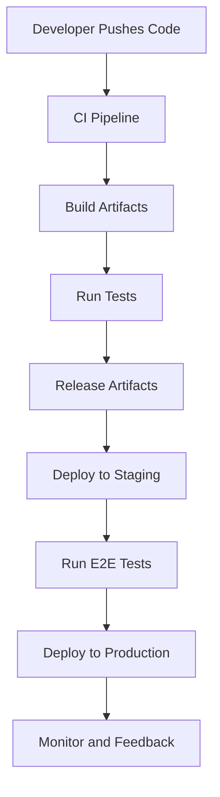

## 1. If there are 100 properties that are common for all 10 microservices , then how to manage those properties, should I put 100 properties in each microservice or is there any other way to manage this?

If you have **100 properties** that are **common across 10 microservices**, it’s not efficient or maintainable to replicate these properties in each microservice. Instead, you can centralize and manage these common properties to ensure consistency and reduce redundancy. Below are some best practices for managing shared configuration across multiple microservices:

---

### **1. Centralized Configuration Management**
Use a centralized configuration management tool to store and manage the shared properties. Examples include:
- **Spring Cloud Config** (if you use Java Spring Boot)
- **Consul**
- **ETCD**
- **AWS Systems Manager Parameter Store**
- **HashiCorp Vault** (for sensitive properties like secrets)

**How It Works:**
- Store the shared properties in the centralized config system.
- Microservices fetch these properties at runtime via APIs or SDKs provided by the tool.

**Advantages:**
- Single source of truth for shared properties.
- Changes to the properties don’t require redeploying microservices.
- Environment-specific configurations (e.g., dev, staging, production) are handled easily.

**Example Workflow:**
1. Define properties in Spring Cloud Config:
   ```yaml
   common.properties:
     database.url: jdbc:mysql://common-db:3306
     cache.timeout: 300
   ```
2. Microservices retrieve these properties using the **Spring Boot Starter Config** or a similar mechanism.

---

### **2. Shared Configuration Library**
Create a **shared configuration library** that contains the common properties. Each microservice can include this library as a dependency.

**How It Works:**
- Build a library or module that encapsulates the common properties and logic to access them.
- Publish the library to a private package repository (e.g., Maven, npm, PyPI).
- Microservices import the library and use it to access shared properties.

**Advantages:**
- Consistency across microservices with minimal duplication.
- Common logic for accessing or transforming the properties can also be shared.

**Example in Java (Spring Boot):**
- Create a shared library `common-config`:
   ```java
   public class CommonConfig {
       public static final String DATABASE_URL = "jdbc:mysql://common-db:3306";
       public static final int CACHE_TIMEOUT = 300;
   }
   ```
- Microservices include the library as a dependency and use:
   ```java
   String dbUrl = CommonConfig.DATABASE_URL;
   ```

---

### **3. Environment Variables**
For smaller-scale setups, use **environment variables** to store shared properties. Each microservice retrieves these properties at runtime.

**How It Works:**
- Define common properties as environment variables.
- Microservices read the environment variables using the system API or configuration frameworks.

**Advantages:**
- Simpler setup for small-scale systems.
- Easy to integrate with containerized deployments (e.g., Docker, Kubernetes).

**Example:**
- Define environment variables in `Kubernetes ConfigMaps` or Docker:
   ```yaml
   DATABASE_URL: jdbc:mysql://common-db:3306
   CACHE_TIMEOUT: 300
   ```
- Microservices access these variables:
   ```python
   import os
   db_url = os.getenv("DATABASE_URL")
   cache_timeout = int(os.getenv("CACHE_TIMEOUT"))
   ```

---

### **4. API Gateway for Dynamic Configuration**
Use an **API Gateway** or a dedicated **Configuration Service** to expose shared properties dynamically.

**How It Works:**
- Create a configuration service or API endpoint that microservices can call to retrieve shared properties.
- Microservices periodically fetch these configurations at runtime.

**Advantages:**
- Dynamic updates to properties without redeploying services.
- Allows versioning of configurations.

**Example API Response:**
```json
{
  "database_url": "jdbc:mysql://common-db:3306",
  "cache_timeout": 300
}
```
Microservices fetch and parse this response on startup or periodically.

---

### **5. Using Kubernetes ConfigMaps or Secrets**
For containerized environments, **Kubernetes ConfigMaps** or **Secrets** can store shared configurations.

**How It Works:**
- Define common properties in a ConfigMap or Secret.
- Mount the ConfigMap as environment variables or files in pods.

**Advantages:**
- Centralized configuration management within Kubernetes.
- Configurations are automatically updated in running pods.

**Example ConfigMap:**
```yaml
apiVersion: v1
kind: ConfigMap
metadata:
  name: common-config
data:
  DATABASE_URL: jdbc:mysql://common-db:3306
  CACHE_TIMEOUT: "300"
```
Microservices read these properties as environment variables.

---

### **Comparison of Approaches**

| Approach                     | Use Case                                             | Complexity | Dynamism         |
|------------------------------|------------------------------------------------------|------------|------------------|
| Centralized Config Tools     | Large-scale systems needing dynamic updates          | Medium     | High             |
| Shared Configuration Library | Smaller systems, primarily static shared properties  | Low        | Low              |
| Environment Variables        | Simple setups or containerized environments          | Low        | Medium           |
| API Gateway for Config       | Systems requiring runtime configuration updates      | High       | High             |
| Kubernetes ConfigMaps        | Kubernetes-based systems                             | Medium     | Medium           |

---

### **Recommendation**
- **Large-scale, dynamic systems**: Use **Centralized Config Tools** like Consul or Spring Cloud Config.
- **Smaller, static systems**: Use a **Shared Configuration Library**.
- **Kubernetes environments**: Use **ConfigMaps**.
- For **sensitive data**: Use **HashiCorp Vault** or similar tools.


## 2. What all things to check in my code for PR Review Check?


A **Pull Request (PR) Review Checklist** ensures that the code is of high quality, aligns with project standards, and is maintainable. Here’s a comprehensive checklist broken into categories:

---

### **1. Code Quality**
- **Correctness**: Does the code solve the intended problem or implement the desired feature?
- **Readability**:
  - Is the code easy to understand?
  - Are variable and function names meaningful and descriptive?
- **Maintainability**:
  - Is the code modular and reusable?
  - Are there any hardcoded values that should be configurable?
- **Consistency**: Does the code follow project or organizational conventions (e.g., naming, structure)?

---

### **2. Functionality**
- **Logic**:
  - Does the code handle edge cases and unexpected inputs?
  - Are conditional statements and loops optimized and necessary?
- **Correct Outputs**:
  - Are functions returning the expected results?
  - Are all outputs properly validated?

---

### **3. Security**
- **Validation**:
  - Are inputs validated to prevent SQL injection, XSS, or other vulnerabilities?
  - Is data sanitized before processing or displaying?
- **Secrets**:
  - Are sensitive data (e.g., API keys, passwords) stored securely (e.g., environment variables, secret management tools)?
- **Authentication and Authorization**:
  - Are all endpoints and functionalities protected against unauthorized access?
  - Are roles and permissions correctly applied?

---

### **4. Performance**
- **Efficiency**:
  - Are there any unnecessary computations, loops, or database calls?
  - Are large data operations paginated or batched where appropriate?
- **Scalability**:
  - Is the code designed to handle increasing loads?
  - Are there any potential bottlenecks or single points of failure?

---

### **5. Error Handling and Logging**
- **Error Handling**:
  - Are exceptions properly caught and handled?
  - Are error messages meaningful and user-friendly?
- **Logging**:
  - Are logs used appropriately (not too verbose in production)?
  - Are sensitive data excluded from logs?
- **Debugging**:
  - Are debug statements removed from production-ready code?

---

### **6. Tests**
- **Test Coverage**:
  - Are there sufficient unit, integration, and/or end-to-end tests?
  - Do tests cover all critical functionality and edge cases?
- **Test Assertions**:
  - Are assertions clear and meaningful?
  - Do the tests fail for incorrect behavior?
- **Automated Testing**:
  - Is the PR passing all Continuous Integration (CI) pipeline checks?

---

### **7. Documentation**
- **Code Comments**:
  - Are complex sections of code adequately commented?
  - Are TODO comments avoided or properly tracked?
- **API Documentation**:
  - Are new or updated APIs documented in Swagger/OpenAPI or equivalent?
- **README/Guides**:
  - Is the README or user guide updated if the change affects usage?
  - Are installation or setup instructions updated if necessary?

---

### **8. Dependencies**
- **External Libraries**:
  - Are third-party libraries necessary and used appropriately?
  - Are library versions pinned to avoid unexpected updates?
- **Security Checks**:
  - Have dependencies been checked for known vulnerabilities?
  - Are dependency updates handled in a separate PR to minimize risk?

---

### **9. Code Style**
- **Formatting**:
  - Is the code formatted according to the project's style guide (e.g., Prettier, Black)?
  - Are there unnecessary whitespaces or inconsistent indentations?
- **Linting**:
  - Does the code pass all linting checks (e.g., ESLint, Pylint)?
- **Dead Code**:
  - Are unused variables, methods, or imports removed?

---

### **10. Integration and Compatibility**
- **Backward Compatibility**:
  - Will the change affect existing functionality or APIs?
  - Are deprecated methods or features handled gracefully?
- **Versioning**:
  - If the change introduces breaking changes, has the version number been updated accordingly?
- **Integration**:
  - Does the new code integrate seamlessly with existing modules?
  - Are database schema changes backward-compatible?

---

### **11. Deployment Readiness**
- **Environment-Specific Code**:
  - Are environment-specific configurations handled correctly?
  - Have environment variables been added or updated where needed?
- **Build and CI/CD**:
  - Does the code pass all build steps?
  - Are deployment scripts updated if necessary?

---

### **12. Team Standards and Collaboration**
- **Commit Messages**:
  - Are commit messages descriptive and meaningful?
  - Are commits logically grouped and not overly granular?
- **PR Description**:
  - Is the PR description clear about the purpose and scope of the change?
  - Are testing instructions included in the PR?
- **Review Requests**:
  - Are relevant team members or domain experts requested for the review?

---

### **Example PR Checklist**

```markdown
### PR Checklist

- [ ] Code adheres to project standards and style guide.
- [ ] All edge cases and unexpected inputs are handled.
- [ ] Sensitive information is not exposed.
- [ ] Tests added/updated for new functionality.
- [ ] CI checks are passing.
- [ ] Documentation is updated (e.g., README, API docs).
- [ ] Code is reviewed for performance and scalability.
- [ ] No unnecessary libraries or dependencies added.
- [ ] Changes integrate seamlessly with existing codebase.
```


## 3. How to properly version my services in docker ?

Versioning Docker services properly is crucial for maintaining consistency, compatibility, and traceability in a microservices-based environment. Below are best practices for versioning Docker services:

---

### **1. Use Semantic Versioning (SemVer)**
Follow the [Semantic Versioning](https://semver.org/) convention:  
**`MAJOR.MINOR.PATCH`**
- **MAJOR**: Incremented for breaking changes.
- **MINOR**: Incremented for backward-compatible new features.
- **PATCH**: Incremented for bug fixes and patches.

**Example:**
- `1.0.0`: Initial release.
- `1.1.0`: Added a new feature.
- `2.0.0`: Introduced a breaking change.

---

### **2. Include Git Commit or Tag in Image Versions**
Incorporate the Git commit hash or tag into the image version to ensure traceability.  
- Use Git tags for release versions:
  ```bash
  docker build -t my-service:1.0.0 .
  ```
- Add the commit hash for development builds:
  ```bash
  docker build -t my-service:1.0.0-abc1234 .
  ```

---

### **3. Leverage Latest Tags for Development (Cautiously)**
- Use `latest` tag for the most recent build, but avoid relying on it in production.
- **Why?** It can lead to inconsistencies if the `latest` tag points to a different version than expected.

**Example:**
- `latest` for development builds:
  ```bash
  docker build -t my-service:latest .
  ```
- Specific version for production:
  ```bash
  docker build -t my-service:1.0.0 .
  ```

---

### **4. Include Environment or Branch in Tag Names**
Differentiate builds for environments or branches.  
- **Environment-based tags**:
  ```bash
  docker build -t my-service:1.0.0-prod .
  docker build -t my-service:1.0.0-staging .
  docker build -t my-service:1.0.0-dev .
  ```
- **Branch-based tags**:
  ```bash
  docker build -t my-service:1.0.0-feature-xyz .
  ```

---

### **5. Automate Versioning with CI/CD**
Use your CI/CD pipeline to automate Docker image versioning:
- Extract the version from your **`package.json`**, **`pom.xml`**, or equivalent file.
- Append the Git commit hash or branch name dynamically.
- Push the image with all relevant tags.

**Example in GitHub Actions:**
```yaml
jobs:
  build:
    runs-on: ubuntu-latest
    steps:
      - name: Check out code
        uses: actions/checkout@v2

      - name: Set up Docker
        uses: docker/setup-buildx-action@v2

      - name: Extract version and commit hash
        run: |
          VERSION=$(cat VERSION_FILE)
          COMMIT_HASH=$(git rev-parse --short HEAD)
          echo "VERSION=$VERSION" >> $GITHUB_ENV
          echo "COMMIT_HASH=$COMMIT_HASH" >> $GITHUB_ENV

      - name: Build and tag Docker image
        run: |
          docker build -t my-service:$VERSION .
          docker build -t my-service:$VERSION-$COMMIT_HASH .
          docker push my-service:$VERSION
          docker push my-service:$VERSION-$COMMIT_HASH
```

---

### **6. Maintain Multi-Tagging**
Use multiple tags for the same image to allow flexibility.  
- Tag for SemVer:
  ```bash
  docker build -t my-service:1.0.0 .
  ```
- Add `latest` for convenience:
  ```bash
  docker tag my-service:1.0.0 my-service:latest
  ```

**Example for multi-tagging:**
```bash
docker build -t my-service:1.0.0 -t my-service:1.0 -t my-service:1 -t my-service:latest .
```

---

### **7. Store Tags in a Versioning Document**
Maintain a **changelog** or **tags.json** file to track released versions:
```json
{
  "version": "1.0.0",
  "tags": ["1.0.0", "latest"],
  "date": "2024-11-15",
  "description": "Initial release with feature X and bug fix Y."
}
```

---

### **8. Enforce Immutable Tags in Your Registry**
Ensure that once a Docker image tag is pushed to your registry, it cannot be overwritten. This is supported by most registries like Docker Hub, AWS ECR, and Google Artifact Registry.

**How to enable immutability:**
- **AWS ECR**: Use the `put-lifecycle-policy` command.
- **Docker Hub**: Avoid pushing with the same tag unless intentional.

---

### **9. Use Image Scanning for Version Compliance**
Scan your images for vulnerabilities to ensure that every version adheres to security best practices:
- Tools like **Trivy**, **Clair**, or **Snyk** can integrate into your CI/CD pipelines to enforce quality standards before releasing a new version.

---

### **10. Monitor and Prune Old Versions**
Regularly remove unused or outdated versions to reduce storage costs and improve clarity in your image repository.

**Prune unused images:**
```bash
docker image prune
```

**Registry cleanup tools:**
- Docker Hub: Retention policies.
- AWS ECR: Lifecycle rules for automatic cleanup.

---

### **Example Versioning Strategy**
- Development:
  - `my-service:1.0.0-alpha`
  - `my-service:1.0.0-feature-xyz`
- Staging:
  - `my-service:1.0.0-rc1`
- Production:
  - `my-service:1.0.0`
  - `my-service:1.0`
  - `my-service:latest`

---

### **Key Best Practices**
- **Avoid mutable tags like `latest` in production.**
- Use **semantic versioning** for clarity.
- Automate versioning through **CI/CD pipelines.**
- Maintain a consistent versioning strategy across teams and environments.


### **Hands-On Example: Automating Docker Versioning in CI/CD**

Let’s automate Docker versioning using GitHub Actions. The pipeline will:
1. Extract the version number from a `VERSION` file or Git tags.
2. Append the short commit hash to the version for traceability.
3. Build the Docker image and tag it with:
   - Semantic Version (e.g., `1.0.0`)
   - Commit Hash (e.g., `1.0.0-abc1234`)
   - `latest` (if on the main branch)
4. Push the image to Docker Hub.

---

### **Setup**

1. **Prerequisites**:
   - Install and configure Docker locally.
   - Create a Docker Hub account and generate an access token.

2. **Dockerfile**:
   Create a `Dockerfile` for your application.
   ```dockerfile
   FROM node:16
   WORKDIR /app
   COPY . .
   RUN npm install
   CMD ["npm", "start"]
   ```

3. **GitHub Secrets**:
   Add the following secrets to your GitHub repository:
   - `DOCKER_USERNAME`: Your Docker Hub username.
   - `DOCKER_PASSWORD`: Your Docker Hub access token.

---

### **GitHub Actions Workflow**

Save the following workflow in `.github/workflows/docker-versioning.yml`.

```yaml
name: Build and Push Docker Image

on:
  push:
    branches:
      - main
    tags:
      - "v*"

env:
  IMAGE_NAME: your-dockerhub-username/your-image-name

jobs:
  build-and-push:
    runs-on: ubuntu-latest

    steps:
      - name: Checkout code
        uses: actions/checkout@v2

      - name: Set up Docker Buildx
        uses: docker/setup-buildx-action@v2

      - name: Log in to Docker Hub
        uses: docker/login-action@v2
        with:
          username: ${{ secrets.DOCKER_USERNAME }}
          password: ${{ secrets.DOCKER_PASSWORD }}

      - name: Extract version
        id: version
        run: |
          VERSION=$(cat VERSION || echo "0.0.1")
          GIT_HASH=$(git rev-parse --short HEAD)
          echo "VERSION=$VERSION" >> $GITHUB_ENV
          echo "GIT_HASH=$GIT_HASH" >> $GITHUB_ENV
          echo "IMAGE_TAG=$VERSION-$GIT_HASH" >> $GITHUB_ENV
          if [[ $GITHUB_REF == refs/heads/main ]]; then
            echo "LATEST=true" >> $GITHUB_ENV
          else
            echo "LATEST=false" >> $GITHUB_ENV
          fi

      - name: Build and tag Docker image
        run: |
          docker build -t $IMAGE_NAME:${{ env.VERSION }} .
          docker tag $IMAGE_NAME:${{ env.VERSION }} $IMAGE_NAME:${{ env.VERSION }}-${{ env.GIT_HASH }}
          if [[ $LATEST == "true" ]]; then
            docker tag $IMAGE_NAME:${{ env.VERSION }} $IMAGE_NAME:latest
          fi

      - name: Push Docker image
        run: |
          docker push $IMAGE_NAME:${{ env.VERSION }}
          docker push $IMAGE_NAME:${{ env.VERSION }}-${{ env.GIT_HASH }}
          if [[ $LATEST == "true" ]]; then
            docker push $IMAGE_NAME:latest
          fi
```

---

### **How It Works**

1. **Trigger**:
   - The workflow triggers on `push` to the `main` branch or on Git tags starting with `v` (e.g., `v1.0.0`).

2. **Extract Version**:
   - Reads the `VERSION` file or uses a default (`0.0.1`).
   - Extracts the Git commit hash and appends it to the version.

3. **Build and Tag**:
   - Builds the Docker image and tags it with:
     - The version (`1.0.0`)
     - The version and Git hash (`1.0.0-abc1234`)
     - `latest` (for the main branch).

4. **Push to Docker Hub**:
   - Pushes all the tags to Docker Hub.

---

### **Testing**

1. Create a `VERSION` file in your repository:
   ```bash
   echo "1.0.0" > VERSION
   git add VERSION
   git commit -m "Add version file"
   git push origin main
   ```

2. Trigger the workflow by:
   - Committing to the `main` branch.
   - Creating a tag:
     ```bash
     git tag v1.0.0
     git push origin v1.0.0
     ```

3. Check Docker Hub for the uploaded image:
   - `your-dockerhub-username/your-image-name:1.0.0`
   - `your-dockerhub-username/your-image-name:1.0.0-abc1234`
   - `your-dockerhub-username/your-image-name:latest`

---

### **Enhancements**

- **Multi-Arch Builds**:
  Add support for multiple architectures (e.g., AMD64, ARM):
  ```yaml
  - name: Build and push multi-arch image
    uses: docker/build-push-action@v4
    with:
      push: true
      tags: |
        ${{ env.IMAGE_NAME }}:${{ env.VERSION }}
        ${{ env.IMAGE_NAME }}:${{ env.VERSION }}-${{ env.GIT_HASH }}
        ${{ env.IMAGE_NAME }}:latest
      platforms: linux/amd64,linux/arm64
  ```

- **Dependency Scanning**:
  Use tools like **Trivy** to scan the image for vulnerabilities before pushing:
  ```yaml
  - name: Scan Docker image for vulnerabilities
    uses: aquasecurity/trivy-action@v0.4.1
    with:
      image-ref: ${{ env.IMAGE_NAME }}:${{ env.VERSION }}
  ```

---


## 4. What are the steps to follow for proper CICD?

Implementing proper CI/CD (Continuous Integration and Continuous Deployment) involves a series of structured steps to ensure code is integrated, tested, and deployed efficiently and reliably. Here’s a detailed guide:

---

### **1. Set Up a Source Code Repository**
- Use a version control system like **Git** and a platform like **GitHub**, **GitLab**, **Bitbucket**, or **Azure Repos**.
- Organize your codebase:
  - Separate branches for development (`dev`), staging (`staging`), and production (`main` or `master`).
  - Use feature branches for individual tasks or features.

**Best Practices:**
- Enforce branch naming conventions.
- Use pull requests (PRs) for code reviews.

---

### **2. Establish CI/CD Pipeline Stages**
A proper CI/CD pipeline includes multiple stages:

1. **Source Stage**:
   - Trigger the pipeline automatically on:
     - Code commits or PRs.
     - Merges into specific branches (e.g., `main`, `dev`).
     - Tagging a release (e.g., `v1.0.0`).

2. **Build Stage**:
   - Compile code, resolve dependencies, and generate artifacts (e.g., `.jar`, `.war`, `.docker` images).
   - Run static code analysis using tools like **SonarQube**, **Checkstyle**, or **ESLint**.

3. **Test Stage**:
   - Run automated tests:
     - Unit tests: Verify individual components.
     - Integration tests: Test interactions between components.
     - End-to-End (E2E) tests: Test the entire application flow.
   - Code coverage analysis (e.g., with **JaCoCo**, **CodeCov**).

4. **Release Stage**:
   - Package and version the build (e.g., tag Docker images).
   - Push artifacts to a repository:
     - **Docker Hub**, **AWS ECR** for Docker images.
     - **Nexus**, **JFrog Artifactory** for binaries.

5. **Deploy Stage**:
   - Deploy to:
     - Dev/staging environment for manual or automated validation.
     - Production using blue-green, rolling, or canary deployment strategies.
   - Use tools like **Kubernetes**, **Terraform**, or **AWS CloudFormation** for infrastructure automation.

6. **Monitor Stage**:
   - Use monitoring tools like **Prometheus**, **Grafana**, **ELK Stack**, or **AWS CloudWatch** to observe system performance and logs.
   - Set up alerts for failures or performance issues.

---

### **3. Implement CI/CD Tools**
Choose tools to implement and manage each stage:
- **Source Code Management**: GitHub, GitLab, Bitbucket.
- **Build**: Jenkins, GitHub Actions, GitLab CI, CircleCI, Azure DevOps.
- **Testing**: JUnit, Selenium, Postman, Cypress, or Pytest.
- **Artifact Repository**: Docker Hub, AWS ECR, JFrog Artifactory.
- **Deployment**: Kubernetes, Helm, Terraform, Ansible.

---

### **4. Automate Testing**
Automated testing ensures reliability and reduces manual effort:
- **Unit Tests**: Test individual modules or functions.
- **Integration Tests**: Validate communication between services.
- **E2E Tests**: Simulate user workflows.
- **Performance Tests**: Test the application under load.
- **Security Tests**: Run tools like **OWASP ZAP**, **Snyk**, or **Trivy**.

---

### **5. Containerization and Orchestration**
- Use **Docker** to containerize applications.
- Use **Kubernetes** or **Docker Swarm** for container orchestration.

**Best Practices:**
- Create multi-stage Dockerfiles to minimize image size.
- Store environment-specific configurations in **Kubernetes ConfigMaps**, **Secrets**, or parameter stores (e.g., AWS SSM).

---

### **6. Implement Deployment Strategies**
- **Blue-Green Deployment**:
  - Deploy a new version in a separate environment.
  - Switch traffic to the new version after validation.
- **Canary Deployment**:
  - Gradually route traffic to the new version to detect issues.
- **Rolling Deployment**:
  - Replace old instances with new ones incrementally.

---

### **7. Use Infrastructure as Code (IaC)**
- Automate infrastructure provisioning with tools like **Terraform**, **AWS CloudFormation**, or **Ansible**.
- Maintain IaC templates in version control for consistency.

---

### **8. Implement Security in the Pipeline**
- Use **Static Application Security Testing (SAST)** to analyze code for vulnerabilities.
- Use **Dynamic Application Security Testing (DAST)** for runtime vulnerability detection.
- Scan containers with tools like **Trivy**, **Aqua Security**, or **Clair**.

---

### **9. Monitor and Rollback Mechanisms**
- Set up monitoring tools to track:
  - Application logs (e.g., **ELK Stack**, **Fluentd**).
  - Metrics (e.g., **Prometheus**, **CloudWatch**).
- Enable rollback mechanisms:
  - Store previous deployment states for quick rollbacks.
  - Use Git tags or branches to revert code changes.

---

### **10. Automate Notifications**
- Integrate notifications into your pipeline using tools like:
  - **Slack** or **Microsoft Teams** for updates.
  - **PagerDuty** for incident alerts.

---

### **11. Document the Pipeline**
- Create clear documentation for:
  - CI/CD pipeline workflows.
  - Troubleshooting common issues.
  - Guidelines for onboarding new team members.

---

### **12. Regularly Review and Optimize**
- Conduct retrospectives after major releases to identify improvement areas.
- Regularly update tools and processes to leverage new features or address bottlenecks.

---

### **Key CI/CD Flow**




